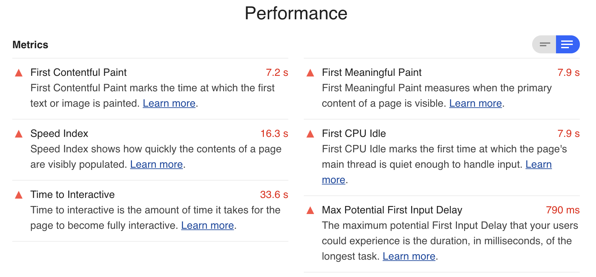

= Code Splitting mit React Lazy und React Suspense
:source-highlighter: highlightjs
:highlightjsdir: highlight
:highlightjs-theme: a11y-light
:toc:
Maik Figura <maik.figura@codecentric.de>
v1.0, 2019-07-01

NOTE: Demo Repository for a german blog post I wrote on www.codecentric.de about lazy loading React components.

== Warum
In diesem Artikel fokussieren wir uns darauf, wie der initiale JavaScript-Payload, der beim Laden einer Webseite anfällt, reduziert werden kann und Skripte erst dann geladen werden, wenn sie wirklich benötigt werden, um so die `Time to Interactive` zu veringern. Dieser Artikel richtet sich an React-Einsteiger mit grundlegendem Verständnis in React und TypeScript.

Der durch mobile Endgeräte verbrauchte Traffic nimmt zu. So wurde in den USA im Jahr https://techjury.net/stats-about/mobile-vs-desktop-usage/[2017] knapp 63 % des Traffics durch mobile Endgeräte verursacht. Oft sind Nutzer frustriert durch lange Ladezeiten oder schlechte Verbindungen. Das langsame Laden und Anzeigen einer Webseite hat oft viele Ursachen. Laut dem https://v8.dev/blog/cost-of-javascript-2019[Cost of Javascript 2019 Report] von Addy Osmani ist eine dieser Ursachen inzwischen, dass der initiale JavaScript-Payload, der zum Anzeigen der Landing Page nötig ist, groß ist. Dies ist in doppelter Hinsicht schlecht. Denn je größer die initialen Skripte sind, desto länger dauert es, diese herunterzuladen und infolgedessen zu parsen und auszuführen. Leistungsschwächere Geräte kommen hier schnell an ihre Grenzen; oft weil die https://developer.mozilla.org/en-US/docs/Glossary/Effective_connection_type[effektive Verbindung] schlechter ist als die dem Benutzer angezeigte. Im Vergleich zu ihren nicht mobilen Artgenossen, haben die mobilen Geräte meist langsamere CPUs und GPUs. Damit wir die immer leistungsfähiger werdenden Geräte weiterhin in die Hosentasche stecken können, werden einige von ihnen, aufgrund ihrer immer kompakter werdenden Bauform und der damit verbundenen Überhitzungsgefahr, gedrosselt. Die https://developers.google.com/web/tools/lighthouse/audits/time-to-interactive[`Time to Interactive`], also die Zeit bis eine Webseite komplett funktionsfähig geladen ist, unterscheidet sich gravierend, je nach dem wie leistungsfähig das Endgerät ist; laut https://medium.com/@addyosmani/the-cost-of-javascript-in-2018-7d8950fbb5d4[Addy Osmani] für `news.google.com` zwischen einem Moto G4 (weltweit gesehen ein Durchschnittstelefon) und einem Pixel 2 um den Faktor drei. Selbst auf leistungsfahigen Endgeräten wie einem MacBook ist die `TTI` oft lang. Hier kann Code-Splitting  mit React Lazy und React Suspense helfen.

.CNN Performance auf einem Macbook via LTE

Seit Jahren ist ein https://beta.httparchive.org/reports/state-of-javascript#bytesJs[Zuwachs] an Javascript-Skripten zu beobachten, die auf Webseiten benötigt werden. Auch die Anzahl an externen Javascript-Quellen nimmt langsam aber stetig zu. Warum es sich lohnt die `TTI` zu optimieren zeigen Fallstudien von https://www.creativebloq.com/features/how-the-bbc-builds-websites-that-scale[BBC] oder auch https://medium.com/@Pinterest_Engineering/driving-user-growth-with-performance-improvements-cfc50dafadd7[Pinterest]. So konnte die BBC zeigen, dass sie für jede Sekunde längeren Ladens der Webseite 10 % der Benutzer verlieren. Auch bei Pinterest wird der Einfluss deutlich. Sie zeigten, dass die Menge an Sign-Ups und Suchmaschinen-Traffic um 15 % zugenommen hat, nachdem sie ihre (vom Benutzer) empfundenen Wartezeiten um 40 % verringert haben.

== Voraussetzungen
Single-Page-Applications werden auf dem Client ausgeführt, das heisst in der Regel wird eine Javascript-Datei (das `Bundle`) heruntergeladen, geparst und ausgeführt. Je größer dieses Bundle beim initialen Laden ist, desto größer wird die `Time to Interactive`. Es bietet sich also an, via Code-Splitting, nicht initial benötigte Teile des Bundles später zu laden. React bietet hierfür ab Version https://github.com/facebook/react/blob/master/CHANGELOG.md#1660-october-23-2018[16.0] zwei sinnvolle APIs an: 

- https://reactjs.org/docs/react-api.html#suspense[Suspense] -- um auf Komponenten zu warten und einen Fallback anzuzeigen bis diese gemountet werden und 
- https://reactjs.org/docs/react-api.html#reactlazy[Lazy] -- um Komponenten dynamisch nachzuladen um so die Bundle Größe zu veringern. 

Eine kleine Demo-Application soll uns als Beispiel dienen. Die App wird einen Knopf besitzen. Wird er gedrueckt, werden (lazy) Katzenbilder geladen, um sie dann anzuzeigen.    

Zuerst werden wir eine Typescript basierte React App anlegen. Dazu verwenden wir https://github.com/npm/npx[`npx`] und https://facebook.github.io/create-react-app/[`create-react-app`]. Im Terminal legen wir mit dem Befehl

[source, bash]
----
npx create-react-app lazy-suspense-cats --typescript
cd lazy-suspense-cats
----
 
unsere App an und welchseln in den neu erstellen Ordner. Ausserdem installieren wir noch einige Abhängigkeiten, die wir später benötigen werden:

[source, bash]
----
yarn add @testing-library/react @types/react-dom react-dom axios
----

Nun sollte die Datei `package.json` so aussehen:

[source]
----
include::package.json[]
----

== Cat App

Damit können wir loslegen. Wir schreiben als erstes einen Test für eine Komponente, die ein Bild anzeigt. Das Bild bekommt die Komponente von aussen hereingereicht, ebenso wie den `alt` Text. Im `src` Ordner legen wir die Dateien `Cat.tsx` und `Cat.spec.tsx` an. Für unsere Tests verwenden wir https://testing-library.com/docs/react-testing-library/intro[`@testing-library/react`]. Sie motiviert uns Tests zu schreiben, die widerspiegeln, wie Benutzer*innen unsere App verwenden werden. Nun fügen wir in der Datei `Cat.spec.tsx` den Test hinzu.  

[source,TypeScript]
----
include::./src/Cat.spec.tsx[]
----

Die Funktion https://testing-library.com/docs/react-testing-library/api#cleanup[`cleanup()`] sorgt dafür, dass nach jedem Test Übrigbleibsel von `render` aufgeräumt werden. Im Test selbst erzeugen wir eine `url` und einen `altText`, welche die Komponente als `props` überreicht bekommt. Dann rendern wir die Komponente mit den entsprechenden `props`. Einen `expect` Block brauchen wir nicht, da https://testing-library.com/docs/dom-testing-library/api-queries#byalttext[`getByAltText`] im Fehlerfall bereits eine Exception wirft.  

Unsere Tests können wir mit `yarn test` im Projektverzeichnis ausführen. Unser erster Test sollte fehlschlagen: 

[source]
-----
FAIL  src/Cat.spec.tsx
 Cat
   ✕ should render an image (24ms)
...
-----

Nebenbei macht es Sinn, via `yarn start` den Entwicklungsserver zu starten, welcher bei Änderungen neu geladen wird. Unter `localhost:3000` können wir unsere Frontend-App im Browser aufrufen. 

=== Cat Komponente
Jetzt machen wir uns an die Implementierung unserer `Cat.tsx` Komponente. Sie bekommt als `props` eine `imageUrl`, einen `altText` und optional einen CSS `style`: 

[source, TypeScript]
----
include::./src/Cat.tsx[]
----

Führen wir nun unseren Test wieder aus, sollte dieser durchlaufen.

[source]
----
PASS  src/Cat.spec.tsx
----

Lazy ist hier natuerlich noch nichts. Daher bauen wir als nächstes eine Komponente, welche uns einen Button anzeigt. Wird dieser geklickt, soll via https://github.com/axios/axios[axios] der REST Endpunkt `https://api.thecatapi.com/v1/images/search?&limit=80` gerufen werden. Wir bekommen ein JSON zurueck, welches 80 Katzenobjekte enthält. Darunter ist auch die URL, die wir für die `Cat` Komponente brauchen. Dazu mappen wir jeweils die URL einer Katze auf eine `Cat`-Komponente.

=== ToggleCat Komponente

Zuerst legen wir eine `ToggleCat.spec.tsx` und `ToggleCat.tsx` Datei an. Ausserdem passen wir die Datei `index.tsx` so an, dass sie unsere neue Komponente `ToggleCat` direkt läd.

[source, TypeScript]
----
include::./src/index.tsx[]
----
 
Als nächstes schreiben wir einen Test, welcher:

- ein `cats` JSON erzeugt, der für unseren Test verwendet wird,
- axios mockt und beim Aufruf von `axios.get` dieses JSON zurückliefert,
- prüft, ob nichts angezeigt wird, bevor der Knopf gedrückt ist,
- den Knopf drückt, 
- prüft, ob bis zum ersten Mount eine Fallback-Komponente angezeigt wird
- prüft, ob nach einer gewissen Zeit zwei `Cat` Komponenten angezeigt werden.

[source,TypeScript]
----
include::./src/ToggleCat.spec.tsx[]
----

Da wir später "lazy" arbeiten wollen, arbeiten wir direkt mit `waitForElement`, sodass unser Test ggf. warten kann, bis lazy importiert wurde. 

Eventuell wird noch die Fehlermeldung: `Warning: An update to ToggleCat inside a test was not wrapped in act(...).` angezeigt. Diese kann ignoriert werden (siehe Kommentar im Quellcode). Los bekommt man sie, indem man im `src/` Verzeichnis die Datei `setupTests.js` mit folgendem Inhalt hinzufügt: 

[source, JavaScript]
----
include::./src/setupTests.js[]
----

In der Datei `ToggleCat.tsx` fügen wir zuerst einen Knopf hinzu, der beim Anklicken nichts tut, und einen `useEffect` Hook, welcher sich um das Laden der Katzenobjekte kümmert:

[source, TyperScript]
----
import axios from "axios";
import * as React from "react";

export const ToggleCat = () => {
  const [cats, setCats] = React.useState([]);

  React.useEffect(() => {
    axios
      .get("https://api.thecatapi.com/v1/images/search?&limit=80")
      .then(response => {
        setCats(response.data);
      });
  }, []);

  return (
    

      <button style={{ fontSize: "4em" }}>Show all the cats!</button>
    

  );
};
----

Die Komponente läd somit initial das JSON mit den 80 Katzen und speichert die Response-Daten im Komponenten-State `cats`. Unser entsprechende Test sollte fehlschlagen.

Als nächstes wollen wir via `map` die URLs auf `Cat` Komponenten mappen:

[source, TypeScript]
----
import axios from "axios";
import * as React from "react";
import Cat from "./Cat";

interface Category {
  id: number;
  name: string;
}

interface Cat {
  breeds: [];
  categories: Record<number, Category>;
  url: string;
  width: number;
  height: number;
  id: string;
}

export const ToggleCat = () => {
  const [cats, setCats] = React.useState([]);

  React.useEffect(() => {
    axios
      .get("https://api.thecatapi.com/v1/images/search?&limit=80")
      .then(response => {
        setCats(response.data);
      });
  }, []);

  return (
    

      <button style={{ fontSize: "4em" }}>Show all the cats!</button>
      

        {cats.map((cat: Cat) => (
          <Cat key={cat.id} imageUrl={cat.url} altText={"... a cat ..."} />
        ))}
      

    

  );
};
----

Wenn wir jetzt die App unter `localhost:3000` (sofern `yarn start` ausgeführt wird) aufrufen, sollten wir einen Button und nach kurzer Zeit einige Katzenbilder sehen. Damit die Bilder erst mit dem Klick auf den Knopf erscheinen, fügen wir der `ToggleCat` Komponente einen weiteren State `isActive` hinzu:

[source, TypeScript]
----
...
export const ToggleCat = () => {
  const [cats, setCats] = React.useState([]);
  const [isActive, setIsActive] = React.useState(false);

  React.useEffect(() => {
    axios
      .get("https://api.thecatapi.com/v1/images/search?&limit=80")
      .then(response => {
        setCats(response.data);
      });
  }, []);

  const toggleIsActive = () => {
    setIsActive(!isActive);
  };

  return (
    

      <button style={{ fontSize: "4em" }} onClick={toggleIsActive}>
        Show all the cats!
      </button>
      

        {isActive &&
          cats.map((cat: Cat) => (
            <Cat key={cat.id} imageUrl={cat.url} altText={"... a cat ..."} />
          ))}
      

    

  );
};
----

Jetzt fügen wir noch einige `styles` hinzu. Wir verwenden `Grid`, um die Ausrichtung der Kacheln etwas einfacher zu gestalten:

[source, TypeScript]
----
import axios from "axios";
import * as React from "react";
import Cat from "./Cat";

const catsContainerStyle = {
  gridArea: "cats",
  display: "flex",
  justifyContent: "center",
  alignItems: "center",
  flexWrap: "wrap" as "wrap",
  fontSize: "2em"
};

const catStyle = {
  width: "400px",
  height: "400px",
  objectFit: "contain" as "contain",
  padding: "20px"
};

const layoutStyle = {
  display: "grid",
  gridTemplateAreas: `"button"
      "cats"`,
  gridGap: "10px"
};

interface Category {
  id: number;
  name: string;
}

interface Cat {
  breeds: [];
  categories: Record<number, Category>;
  url: string;
  width: number;
  height: number;
  id: string;
}

export const ToggleCat = () => {
  const [cats, setCats] = React.useState([]);
  const [isActive, setIsActive] = React.useState(false);

  React.useEffect(() => {
    axios
      .get("https://api.thecatapi.com/v1/images/search?&limit=80")
      .then(response => {
        setCats(response.data);
      });
  }, []);

  const toggleIsActive = () => {
    setIsActive(!isActive);
  };

  return (
    

      <button
        style={{ gridArea: "button", fontSize: "4em" }}
        onClick={toggleIsActive}
      >
        Show all the cats!
      </button>
      

        {isActive &&
          cats.map((cat: Cat) => (
            <Cat
              key={cat.id}
              style={catStyle}
              imageUrl={cat.url}
              altText={"... a cat ..."}
            />
          ))}
      

    

  );
};
----

Inzwischen sollte unsere App (nach einem Klick auf den Knopf) so aussehen wie auf dem folgenden Screenshot: 

.App mit Styles aber nicht lazy
image::./img/catsgallery.png[Cats Gallery]

Lazy nachgeladen wird bisher aber immer noch nichts und deshalb schlägt unser Test auch noch fehl. Dies ändern wir jetzt und fügen dafür zuerst eine `Spinner` Komponente in `ToggleCats.tsx` hinzu, welche uns für die Zeit zwischen Laden und erstem Mount als Fallback dient:

[source, TypeScript]
----
const Spinner = () => (
  

    ... Loading ...
  

);
----

Ausserdem definieren wir eine eigene `sleep` Funktion, um für dieses Tutorial die Fallback Komponente länger anzeigen zu können: 

[source, TypeScript]
----
export const sleep = (ms: number) => new Promise(r => setTimeout(r, ms));
----

Damit können wir die zwei letzten wichtigen Änderungen durchführen: 

- Hinzufügen des `React.Lazy` Imports und
- Hinzufügen der `React.Suspense` Komponente, um einen Fallback anzuzeigen.

`React.Lazy` nimmt eine Funktion entgegen, welche den dynamischen `import()` aufruft. Das Ganze soll als Promise zurueckgegeben werden. Der Promise löst sich dann zu einem Modul mit `default` Export auf. Dieses Modul enthält die Komponente, welche lazy geladen werden soll. Damit wir für die Demo den Fallback länger anzeigen lassen können, erzeugen wir nicht nur den dynamischen `import()`, sondern schlafen ein bisschen mit unserer `sleep` Funktion: 

[source, TypeScript]
----
// when button is pressed, sleep and import run concurrently
const Cat = React.lazy(async () => {
  const [moduleExports] = await Promise.all([
    import("./Cat"),
    sleep(4000) // simulate that react needs 4s to import and first render
  ]);
  return moduleExports; // return module with default export containing react component
});
----

Wollen wir nicht schlafen, bevor der lazy import passiert, dann reicht es via: 

[source, TypeScript]
----
const Cat = React.lazy(() => import('./Cat'));
----
zu importieren. 

Als letzten Schritt fügen wir die `React.Suspense` Komponente hinzu, welche es uns ermöglicht die `Spinner` Komponente als Fallback für den Lazy-Import Zeitraum zu rendern (also für die Zeit zwischen dem Klick und dem ersten Rendering der `Cat` Komponenten durch React):

[source, TypeScript]
----

  {isActive &&
    cats.map((cat: Cat) => (
      <React.Suspense key={cat.id} fallback={<Spinner />}>
        <Cat
          style={catStyle}
          imageUrl={cat.url}
          altText={"... a cat ..."}
        />
      </React.Suspense>
  ))}

----

Zusammengefasst sieht unsere `ToggleCats.tsx` dann so aus: 

[source, TypeScript]
----
include::./src/ToggleCat.tsx[]
----

Auch unser Test sollte nun durchlaufen. Durch die `sleep` Funktion sollte der `ToggleCat` Test zwischen vier und fünf Sekunden dauern:

[source]
----
PASS  src/Cat.spec.tsx
PASS  src/ToggleCat.spec.tsx (5.135s)
----

Wenn wir nun im Browser unsere App neu laden und ausprobieren, dann sollte:

- initial nur einen Knopf zu sehen sein, 
- beim Klick auf den Knopf für jedes Katzenbild eine Fallback Komponente erscheinen (`... Loading ...`),
- und sobald die `Cat` Komponente das erste Mal gemountet wird, den Alt-Text des Bildes und dann das Bild selbst zu sehen sein.

Ausserdem können wir in der Developer-Console im Network-Tab sehen, dass der zweite Teil des Bundles erst geladen wird, wenn der Knopf gedrückt wird.

video::./img/screencapture.mov[width=640]

== Zusammenfassung
Warum die `Time to Interactive`, nicht nur im Bezug zu mobilen Endgeräten, wichtig ist und warum es gilt sie so klein wie möglich zu halten, haben wir im ersten Abschnitt hinterleuchtet. Ausserdem haben wir uns angeschaut, warum die `TTI` immer größer wird. Wir haben gesehen, dass sich die `TTI` mit einfachen Mitteln verkürzen lässt. Eines dieser Mittel ist `Code-Splitting`, welches es uns ermöglicht Teile des Bundles erst dann zu laden, wenn sie wirklich benötigt werden. React bietet hierzu zwei APIs an. `React.Lazy` und `React.Suspense`, welche es uns ermöglichen, das Bundle zu teilen und Fallback Komponenten anzuzeigen. 

Wir haben eine kleine Demo-App implementiert, welche Katzenbilder anzeigt und dabei Code-Splitting implementiert. Für eine kleine App, wie diese, ist Code-Spitting in der Praxis nicht nötig. Werden die Apps aber größer und komplexer, so lohnt sich der Mehraufwand schnell. 

Der komplette Quellcode findet sich auch im https://github.com/maiksensi/lazy-suspense-cats-demo[`lazy-suspense-cats-demo`] Repositorz auf Github. Kommentare sind wie immer herzlich willkommen.